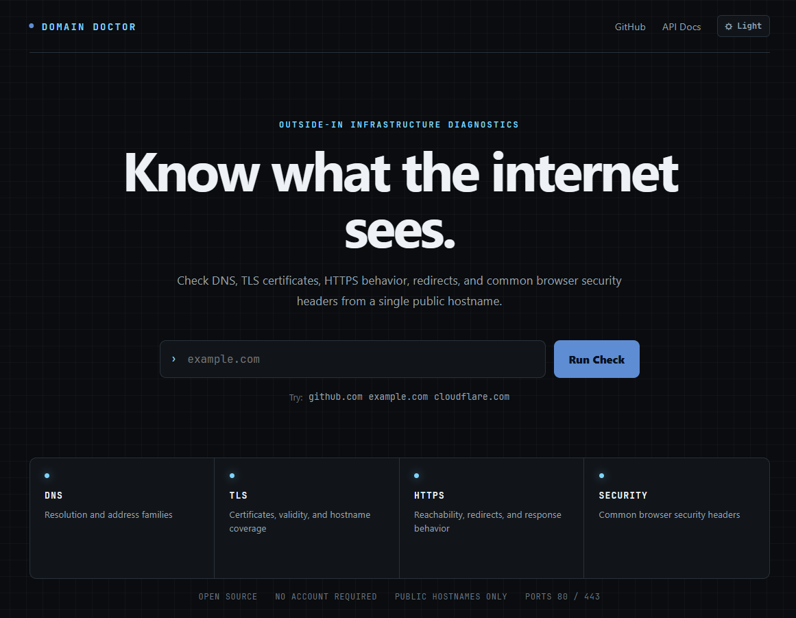
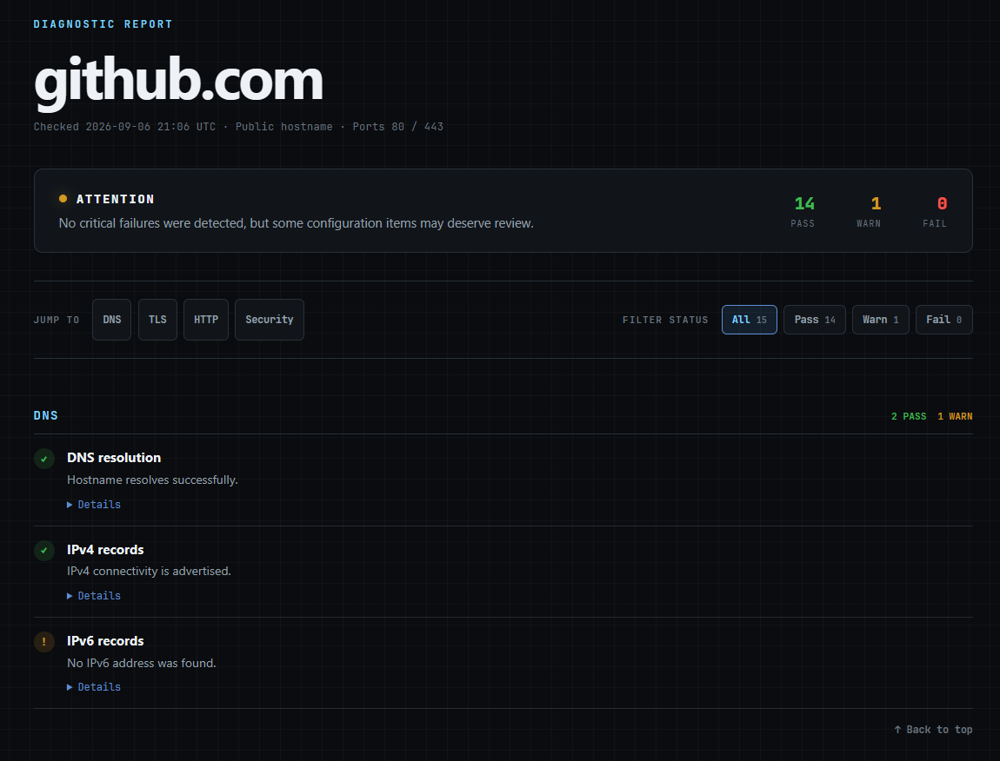

# Domain Doctor

[](https://github.com/casual-loops/domain-doctor/actions/workflows/test.yml)
[](https://www.python.org/)
[](https://fastapi.tiangolo.com/)
[](LICENSE)

**Know what the internet sees.**

**Live site:** https://domaindoctor.fyi

Domain Doctor is an open-source, outside-in diagnostic tool for inspecting the public-facing health of a hostname.

Enter one public hostname and Domain Doctor checks DNS resolution, TLS certificates, HTTPS behavior, redirects, and common browser security headers. No account is required.

Domain Doctor is also free to use as a teaching and learning tool for networking, cybersecurity, web infrastructure, IT support, and systems administration.

## What it checks

| Category | Diagnostics |
| --- | --- |
| DNS | Resolution, IPv4 records, IPv6 records |
| TLS | TLS connectivity, certificate validity, expiration, hostname coverage, certificate verification |
| HTTP | HTTP reachability, HTTP to HTTPS redirects, final HTTPS response, structured redirect-chain visibility |
| Security | HSTS, Content Security Policy, X-Content-Type-Options, Referrer Policy |

Every diagnostic returns one of three states:

| State | Meaning |
| --- | --- |
| PASS | The check completed successfully |
| WARN | The result may deserve review, but does not necessarily indicate a broken service |
| FAIL | The check detected a problem or could not complete safely |

## Interface

Domain Doctor includes a responsive browser interface with light and dark themes, report navigation, status filtering, expandable technical details, an overall diagnostic verdict, and a dedicated redirect-chain timeline for HTTP behavior.

### Landing page



### Diagnostic report



The same diagnostic engine is also available through a JSON API.

## Teaching and learning

Domain Doctor can be used as a free classroom or self-study tool to make otherwise abstract infrastructure concepts visible.

Educators can use it to demonstrate DNS resolution, TLS certificates, HTTPS redirects, browser security headers, and layered troubleshooting with real public websites. Students can compare public sites, inspect technical evidence, and connect networking concepts to observable behavior without creating an account.

The goal is not to make every website produce all PASS results. A warning may be completely acceptable depending on the site's architecture. The value is in understanding what each result means and why different websites behave differently.

See the full [Teaching and Learning Guide](docs/EDUCATION.md) for classroom activities, discussion prompts, troubleshooting exercises, appropriate-use guidance, and student reflection questions.

## API

Check a public hostname:

```text
GET /api/check?host=example.com
```

Example response:

```json
{
  "hostname": "example.com",
  "results": [
    {
      "name": "DNS resolution",
      "category": "DNS",
      "status": "pass",
      "summary": "Hostname resolves successfully.",
      "detail": "example.com resolved to public addresses."
    }
  ]
}
```

Interactive OpenAPI documentation is available on the live site at:

```text
https://domaindoctor.fyi/docs
```

## Security model

Domain Doctor accepts hostnames that cause the server to make outbound network connections, so target validation is part of the application design rather than an afterthought.

The current protections include:

1. IP address literals are rejected.
2. Private, loopback, link-local, reserved, and other non-public addresses are rejected.
3. HTTP and HTTPS are the only permitted protocols.
4. Network connections are restricted to ports 80 and 443.
5. Redirect destinations are validated before they are followed.
6. TLS and HTTP connections are pinned to previously validated public IP addresses.
7. Redirect depth and network timeouts are limited.
8. The production container runs as a non-root user.
9. The Compose configuration drops Linux capabilities and enables `no-new-privileges`.

These controls reduce SSRF risk, but Domain Doctor should still be deployed as an Internet-facing service using defense-in-depth controls such as firewalling, rate limiting, logging, and isolation from private infrastructure.

## Run with Docker Compose

Clone the repository:

```bash
git clone https://github.com/casual-loops/domain-doctor.git
cd domain-doctor
```

Start the application:

```bash
docker compose up -d --build
```

Check container health:

```bash
docker compose ps
```

By default, the development Compose stack exposes Domain Doctor on:

```text
http://localhost:8001
```

Stop it with:

```bash
docker compose down
```

## Run with Python

Python 3.13 is the current development target.

Create a virtual environment:

```bash
python -m venv .venv
```

Activate the environment, then install dependencies:

```bash
python -m pip install -r requirements-dev.txt
```

Start the development server:

```bash
python -m uvicorn app.main:app --reload
```

Open:

```text
http://127.0.0.1:8000
```

## Tests and container publishing

The test suite avoids depending on live Internet services for automated checks. Network behavior is mocked where appropriate so CI results remain deterministic.

Run the suite with:

```bash
python -m pytest -v
```

GitHub Actions runs the test suite on pushes and pull requests to `main`.

A separate GitHub Actions workflow builds and publishes container images to GitHub Container Registry. Main-branch builds publish the `main` image and version tags publish release images.

Container registry:

```text
ghcr.io/casual-loops/domain-doctor
```

## Project structure

```text
domain-doctor/
├── app/
│   ├── checks/
│   │   ├── dns.py
│   │   ├── headers.py
│   │   ├── http.py
│   │   └── tls.py
│   ├── static/
│   ├── templates/
│   ├── main.py
│   ├── models.py
│   └── security.py
├── docs/
│   ├── images/
│   └── EDUCATION.md
├── tests/
├── .github/
│   └── workflows/
│       ├── publish-container.yml
│       └── test.yml
├── Dockerfile
├── compose.yaml
├── requirements.txt
├── requirements-dev.txt
└── README.md
```

## Production architecture

The public service is deployed separately from the development environment.

```text
Internet
  ↓
domaindoctor.fyi
  ↓
Cloud firewall
  ↓
Caddy with automatic TLS
  ↓
Domain Doctor container bound to localhost
```

Production consumes the container image published by GitHub Actions rather than building application source directly on the production server.

## Current scope

Domain Doctor v1.2 focuses on public web service diagnostics with improved HTTP redirect-chain visibility.

It does not currently provide continuous monitoring, historical uptime, account management, email DNS analysis, or multi-resolver DNS comparison.

Those capabilities may be considered for future releases rather than expanding the current release scope.

## License

Domain Doctor is released under the MIT License.

## Author

Built by [casual-loops](https://github.com/casual-loops).
